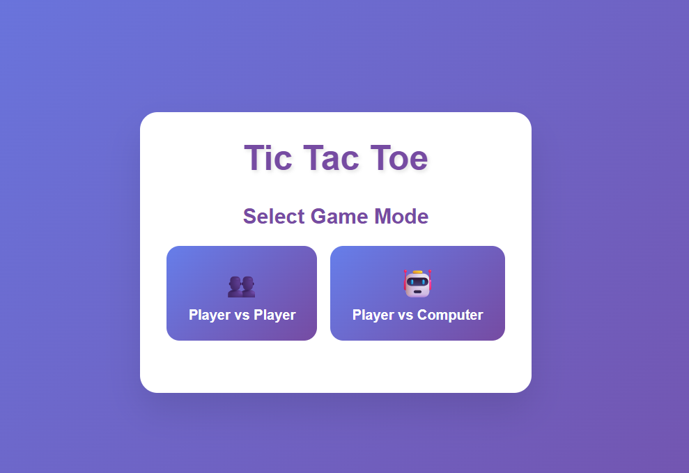
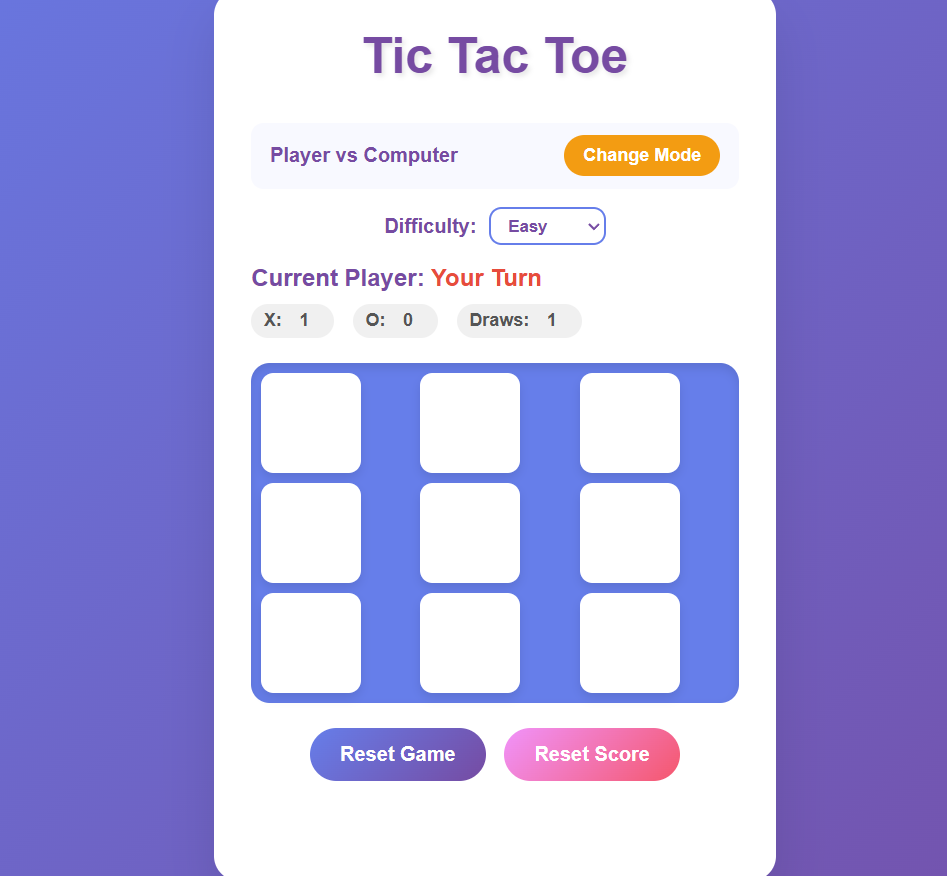

# Tic-Tac-Toe
🎮 Interactive Tic-Tac-Toe Game with Player vs Player and Player vs Computer modes. Features 3 AI difficulty levels (Easy/Medium/Hard), responsive design, score tracking, and smooth animations. Built with vanilla HTML, CSS, and JavaScript.

# 🎮 Tic-Tac-Toe Game

An interactive and modern tic-tac-toe game with multiple game modes and AI opponents.

## ✨ Features

- **Two Game Modes:**
  - 👥 Player vs Player (local multiplayer)
  - 🤖 Player vs Computer (single player)

- **AI Difficulty Levels:**
  - 🟢 Easy: Random moves for beginners
  - 🟡 Medium: Strategic play with some randomness
  - 🔴 Hard: Unbeatable AI using minimax algorithm

- **Modern UI:**
  - Responsive design for all devices
  - Smooth animations and hover effects
  - Color-coded players (X in red, O in blue)
  - Winning combination highlights

- **Game Features:**
  - Score tracking across multiple games
  - Auto-reset after game completion
  - Mode switching without losing progress
  - Visual feedback for current player

## 🚀 How to Play

1. Choose your game mode (Player vs Player or Player vs Computer)
2. Select difficulty if playing against computer
3. Click on empty cells to make your move
4. First to get 3 in a row wins!
5. Use "Change Mode" to switch between game types

## 💻 Technologies Used

- HTML5
- CSS3 (with Flexbox/Grid)
- Vanilla JavaScript (ES6+)
- Responsive Design

## 📱 Screenshots




## 🛠️ Installation

1. Clone the repository:
   ```bash
   git clone https://github.com/Jishnubrata/Tic-Tac-Toe.git
   ```
2. Navigate to the project directory:
```
   cd tic-tac-toe-game
```
3.Open index.html in your web browser or use a local server.

📁 File Structure
```
   tic-tac-toe-game/
├── index.html      # Main HTML structure
├── styles.css      # Styling and animations
├── script.js       # Game logic and AI
└── README.md       # Project documentation
```
🤖 AI Implementation
The computer opponent uses different strategies based on difficulty:

Easy: Completely random moves
Medium: Strategic moves with 70% smart play, 30% random
Hard: Minimax algorithm for perfect play (unbeatable)

🎨 Customization
The game uses CSS custom properties for easy theming. You can modify colors and styles in the styles.css file.

🤝 Contributing
Feel free to fork this project and submit pull requests for any improvements!

📄 License
This project is open source and available under the MIT License.

🙏 Acknowledgments

Inspired by the classic tic-tac-toe game
AI implementation uses the minimax algorithm
Responsive design principles for cross-device compatibility
```
## **Topics/Tags to Add:**
```
javascript, html, css, game, tic-tac-toe, ai, minimax, responsive-design, web-game, vanilla-js, browser-game, two-player, single-player
```
This description will make your repository look professional and help others understand what your project does at a glance!
```
